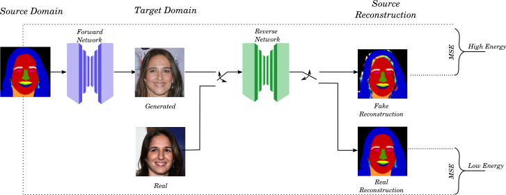

# Dual Inverse Network Optimisation
Official pytorch implementation for the paper [DINO: A Conditional Energy-Based GAN for Domain Translation](https://openreview.net/pdf?id=WAISmwsqDsb)



## Data Preprocessing
The model can train with any **paired** image data. The data from each domain should be 
placed in separate folders and matched images should have the same name (although not 
necessarily the same extension).

### CelebA-HQ-Mask
If you want to use the [CelebA-HQ-Mask](https://github.com/switchablenorms/CelebAMask-HQ) dataset then you can download the images from the 
[official link](https://drive.google.com/open?id=1badu11NqxGf6qM3PTTooQDJvQbejgbTv). If you want to use augmentation during training then 
you must make sure that the segmentation maps are **symmetric** (e.g. same label for left / right ear). To get the symmetric segmentation 
you should use [this fork](https://github.com/DinoMan/CelebAMask-HQ) of the CelebA-HQ-Mask repo and using the g_color script with the 
`--symmetric` option.

### Pix2Pix datasets
The model can also use any of the datasets used for Pix2Pix. To obtain and prepare the data:
1. Download and process the data according to the instructions of the 
   [Pix2Pix](https://github.com/junyanz/pytorch-CycleGAN-and-pix2pix) repo.
2. Split the images from the two domains (they are in the same image for Pix2Pix) using the provided script in the data_preprocessing folder:
```
python split_images -i <pix2pix dataset> -o <left image folder> <right image folder>
```

## Prerequisites
The source code has been tested with python 3.7 and pytorch 1.7.1. To install the dependencies run:
```
pip install -r requirements.txt
```

## Training
To train the model for the unidirectional DINO run:
```
python train.py -f <Domain A folder> <Domain B folder> -n <experiment_name> --ext <image extensions> -g <gpu index>
```
To train the bidirectional model run:

```
python train.py -f <Domain A folder> <Domain B folder> -n <experiment_name> --ext <image extensions> --dual <branching layer for dual head> --ext <image extensions> -g <gpu index>
```

There are many optional arguments to view the full list and their discription run:
```
python train.py -h
```

**Note**: You can also use the `--validation` or `-v` option to specify validation folders.
In this case you will also see results on the validation set during training.

### Resuming Training
If you want to resume the training then you can just use the `--checkpoint` or `-c` option and point it to the saved checkpoint 
that you want to resume from.

### Visualization during training
Training supports visualization using [weights and biases](https://wandb.ai/). 
If you have a weights and biases account you can activate visualization using the
`--wandb` option. 

## Generating Test Data
To perform translation on a folder containing test images just run:
```
python test.py -i <input folder> -g <gpu id> -o <results folder> -c <checkpoint> --direction <AtoB or BtoA>
```
## Pretrained Models
Pretrained models coming soon...
